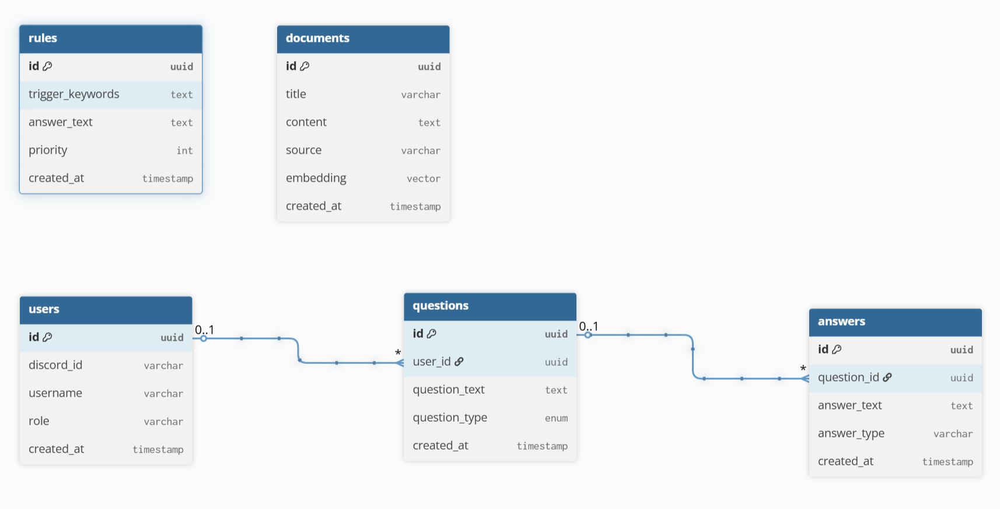

# Database Schema

## Table: users

| Column     | Type      | Description                                |
| ---------- | --------- | ------------------------------------------ |
| id         | UUID (PK) | Unique identifier of the user              |
| discord_id | VARCHAR   | Discord user ID                            |
| username   | VARCHAR   | Discord username                           |
| role       | VARCHAR   | User role (e.g., executive, developer)     |
| created_at | TIMESTAMP | Timestamp when the user record was created |

## Table: questions

| Column        | Type      | Description                                  |
| ------------- | --------- | -------------------------------------------- |
| id            | UUID (PK) | Unique identifier of the question            |
| user_id       | UUID (FK) | Reference to the user who asked the question |
| question_text | TEXT      | Text of the question asked by the user       |
| question_type | ENUM      | Category of the question                     |
| created_at    | TIMESTAMP | Timestamp when the question was created      |

**Question type i.e.**

    CREATE TYPE question_type AS ENUM (
        'documentation',
        'technology',
        'architecture',
        'development',
        'estimation',
        'databases',
        'general'
    );

**Relationship:**

- questions.user_id → users.id

## Table: answers

| Column      | Type      | Description                             |
| ----------- | --------- | --------------------------------------- |
| id          | UUID (PK) | Unique identifier of the answer         |
| question_id | UUID (FK) | Reference to the related question       |
| answer_text | TEXT      | Generated or predefined answer          |
| answer_type | VARCHAR   | Type of answer: rule, rag, or llm       |
| created_at  | TIMESTAMP | Timestamp when the answer was generated |

**Relationship:**

- answers.question_id → questions.id

## Table: rules

| Column           | Type      | Description                                      |
| ---------------- | --------- | ------------------------------------------------ |
| id               | UUID (PK) | Unique identifier of the rule                    |
| trigger_keywords | TEXT      | Keywords used to match incoming questions        |
| answer_text      | TEXT      | Predefined answer returned when the rule matches |
| priority         | INTEGER   | Priority of the rule if multiple rules match     |
| created_at       | TIMESTAMP | Timestamp when the rule was created              |

**Purpose:**

- Rules are checked before RAG or LLM to answer common questions without calling AI.

## Table: documents

| Column     | Type      | Description                                                    |
| ---------- | --------- | -------------------------------------------------------------- |
| id         | UUID (PK) | Unique identifier of the document                              |
| title      | VARCHAR   | Title of the document                                          |
| content    | TEXT      | Text content used for knowledge retrieval                      |
| source     | VARCHAR   | Source of the document (e.g., ArcGIS docs)                     |
| embedding  | VECTOR    | Vector representation of the document used for semantic search |
| created_at | TIMESTAMP | Timestamp when the document was added                          |

**Purpose:**

- Used for RAG (Retrieval Augmented Generation) semantic search.
- Embeddings are stored using pgvector.

## Relationships Overview

    users
        │
        └── questions
                    │
                    └── answers

    rules - rule-based answers
    documents - RAG knowledge base

## DBML

    Table users {
        id uuid [pk]
        discord_id varchar
        username varchar
        role varchar
        created_at timestamp
    }

    Table questions {
        id uuid [pk]
        user_id uuid
        question_text text
        source varchar
        created_at timestamp
    }

    Table answers {
        id uuid [pk]
        question_id uuid
        answer_text text
        answer_type varchar
        created_at timestamp
    }

    Table rules {
        id uuid [pk]
        trigger_keywords text
        answer_text text
        priority int
        created_at timestamp
    }

    Table documents {
        id uuid [pk]
        title varchar
        content text
        source varchar
        embedding vector
        created_at timestamp
    }

    Ref: questions.user_id > users.id
    Ref: answers.question_id > questions.id

## Database diagram

See the database diagram in <a href="https://dbdiagram.io/d/69a87e0ba3f0aa31e1d479a8" target="_blank">https://dbdiagram.io/</a>
